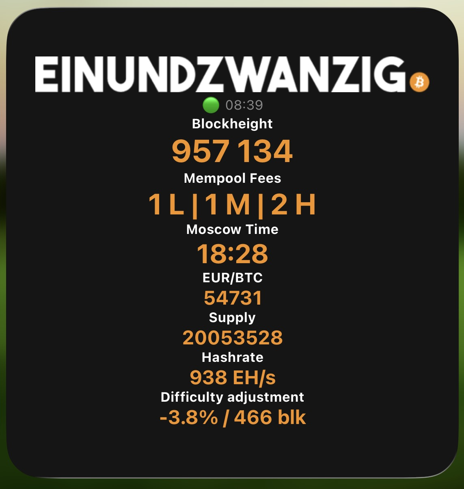
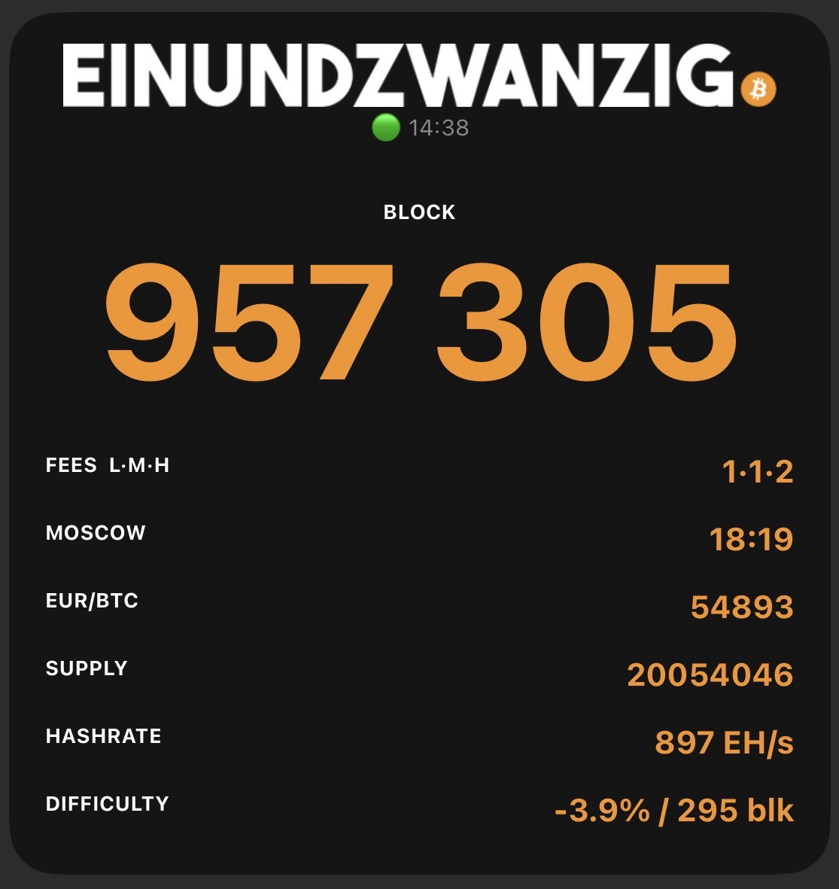

# Einundzwanzig Bitcoin Widget

A Bitcoin data widget for iOS built with [Scriptable](https://scriptable.app), originally created by [FlashmanBTC](https://twitter.com/FlashmanBTC) and maintained by the Einundzwanzig community. Enhanced with parallel requests, timeout handling, status indicators, and fallback URLs.

Displays live Bitcoin data directly on your iOS home screen: block height, mempool fees, Moscow Time, BTC price, circulating supply, hashrate, and difficulty adjustment.

> **On Android?** There is a native version with the same data and themes: [einundzwanzig_widget_android](https://github.com/FlashmanBTC/einundzwanzig_widget_android)




---

## Features

- **Block Height** — current Bitcoin block height
- **Mempool Fees** — low / medium / high sat/vB fee estimates
- **Moscow Time** — satoshis per 1 unit of your chosen fiat currency
- **BTC Price** — current Bitcoin price in EUR, USD, CHF, GBP, CAD, AUD or JPY
- **Circulating Supply** — mined BTC in whole coins
- **Hashrate** — current network hashrate in EH/s
- **Difficulty Adjustment** — expected change in % and remaining blocks

### Reliability

- All API requests run **in parallel** with individual timeouts — one slow API never blocks the others
- Every data source has a **fallback URL** that is tried automatically if the primary fails
- A **status indicator** (🟢 / 🟡 / 🔴) and timestamp show data freshness at a glance
- If the primary source is slow, the next fallback starts after 2 seconds instead of waiting for the full timeout
- **Stale data is rejected**: prices older than one hour and block heights below the last one seen (e.g. from a node that is still syncing) trigger the next fallback
- **Last known values**: if a source is unreachable, the last good value is shown in grey (for up to 24 hours) and the status line shows its age, e.g. `🔴 08:15 · cache 07:40`
- Failed values without a cached value display `⚠️ n/a` in dark grey instead of crashing the widget
- **Update notice**: once a day the widget checks this repository for a newer version and shows `⬆ Update vXX available` — tap the widget to open the repository

### Data Sources

| Data | Primary | Fallback |
|---|---|---|
| Block Height | mempool.space | blockstream.info → mempool.flashman.ch |
| Fees | mempool.space | blockstream.info → mempool.flashman.ch |
| BTC Price | mempool.space | blockchain.info → mempool.flashman.ch |
| Moscow Time | calculated from price | — |
| Supply | calculated from block height (sum of all block subsidies) | — |
| Hashrate | mempool.space | mempool.flashman.ch |
| Difficulty | mempool.space | mempool.flashman.ch |
| Logo | this repository (downloaded once, then stored on the device) | i.ibb.co |

---

## Installation

First, install [Scriptable](https://apps.apple.com/app/scriptable/id1405459188) from the App Store.

### Setup Instructions

1. **On your iPhone**, open this repository in Safari
2. Find the `einundzwanzig_v*.js` file and tap the **Raw** button to view the full code
3. Select all the code (**Ctrl+A** or **Cmd+A**) and copy it
4. Open the **Scriptable** app on your iPhone
5. Tap the **+** button in the top right corner to create a new script
6. Paste the code into the editor
7. Tap the script name at the bottom and rename it to `Einundzwanzig`
9. Go to your home screen, long-press, tap **+** and search for **Scriptable**
10. Add the **large widget size** and edit it to select the `Einundzwanzig` script
11. The widget is now ready and will display Bitcoin data on your home screen

The widget will update automatically whenever you open it, showing live data from the configured APIs.

---

## Configuration

All options are at the very top of the script — no need to read the rest of the code.

### Display Theme

```js
// Design theme: "classic" | "mono"
theme = "mono"
```

| Value | Description |
|---|---|
| `"mono"` | Monospace table style — logo and block height on top, data rows below with label left / value right |
| `"classic"` | Original centered layout — all values stacked vertically |

---

### Currency

```js
// Change currency: EUR, USD, CHF, GBP, CAD, AUD or JPY
currency = "EUR"
```

Affects BTC price and Moscow Time. Supported values: `"EUR"`, `"USD"`, `"CHF"`, `"GBP"`, `"CAD"`, `"AUD"`, `"JPY"`.

---

### Update Check

```js
// Check once a day whether a new widget version is available (1 = on, 0 = off)
check_updates = 1
```

The widget reads [`version.json`](version.json) from this repository at most once a day. If a newer version exists, a line `⬆ Update vXX available` appears under the status line and tapping the widget opens this repository. Nothing is sent except the request itself; set `check_updates = 0` to disable it. The widget never updates itself — you install new versions manually as described above.

---

### Fee Display Order

```js
// Change fee order — 1 = high to low, 0 = low to high
h_to_l = 0
```

| Value | Display |
|---|---|
| `0` | `1 L · 1 M · 3 H` |
| `1` | `3 H · 1 M · 1 L` |

---

### Color Customization

All colors can be customized at the top of the script. Both themes pick them up automatically.

```js
const C_BG        = "#151515"   // widget background
const C_ACCENT    = "#F7931A"   // main value color (Bitcoin orange)
const C_LABEL     = "#FFFFFF"   // section / row labels
const C_DIM       = "#888888"   // status line, subtle text, cached values
const C_ERROR     = "#555555"   // value color when data unavailable
const C_DIVIDER   = "#2a2a2a"   // divider lines (mono theme)
```

---

### Visible Data Sections

Each section can be toggled independently with `1` (on) or `0` (off).

```js
show_block  = 1   // Block height
show_fees   = 1   // Mempool fees
show_moscow = 1   // Moscow Time (sats per fiat unit)
show_price  = 1   // BTC price
show_supply = 1   // Circulating supply
show_hash   = 1   // Network hashrate
show_diff   = 1   // Difficulty adjustment
```

> **Note for `classic` theme:** The widget fits up to 5 active sections comfortably. With 6 or 7 active sections the font sizes scale down automatically to fit. The `mono` theme handles all 7 sections well.

---

### Font Scaling (small screens)

```js
// Scale  0 = iPhone 11 Pro / 13 Pro Max
// Scale -4 = iPhone SE 2020
scale = 0
```

Decrease this value (e.g. `-2`, `-4`) if you have a smaller device and text gets cut off.

---

### Request Timeout

```js
// Timeout per request in seconds
const TIMEOUT_SEC = 6
```

If an API does not respond within this time, the fallback URL is tried. Increase this value if you are on a slow connection, decrease it if you want faster failover.

---

## Version History

| Version | Changes |
|---|---|
| **v11** | Update notice (daily check of `version.json`, tap opens the repository); last known values are shown greyed when a source fails; stale data from a syncing node is rejected; next fallback starts after 2 s instead of waiting for the full timeout; mempool.flashman.ch as additional fallback for block height, fees and price; Moscow Time and supply are calculated locally (no more blockchain.info requests for them); logo is stored on the device; currencies GBP, CAD, AUD, JPY; fix: difficulty value in mono theme used the hashrate status for its color; fix: Moscow Time fallback showed leading zeros |
| **v10** | Fix crash when an API returns an HTTP error (e.g. 503 from fallback): responses are now checked for HTTP status so the fallback and status indicator work correctly; guard for missing difficulty data; fallback server for hashrate and difficulty changed to mempool.flashman.ch |
| **v9** | mono theme adjustments; script converted from `.md` (code block inside Markdown) to a plain `.js` file for easier install, new readme |
| **v8** | Added fallback APIs for hashrate and difficulty (mempool.blitzi.me) |
| **v7** | Fallback URLs for all data sources; new **mono** theme; **classic** theme reworked to show all 7 data sections |
| **v6** | Parallel API requests, per-request timeout handling, status indicator (🟢 / 🟡 / 🔴) |
| **v5** | New screenshots, general code cleanup |
| **v4** | Icon/color tweaks |
| **v3** | Minor fixes and block height updates |
| **v2** | Added font scaling option for smaller devices (iPhone SE) |
| **v1** | Initial release by [FlashmanBTC](https://twitter.com/FlashmanBTC) — block height widget |
---

## License

[MIT](LICENSE) © 2022-2026 FlashmanBTC and contributors
